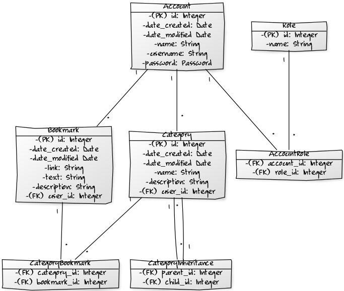

# Database schema

## Schema picture

</img>

## Schema creation

```sql
CREATE TABLE account (
    id INTEGER NOT NULL,
    date_created DATETIME,
    date_modified DATETIME,
    name VARCHAR(200) NOT NULL,
    username VARCHAR(200) NOT NULL,
    password BLOB NOT NULL,
    PRIMARY KEY (id)
);

CREATE TABLE role (
    id INTEGER NOT NULL,
    name VARCHAR(50),
    PRIMARY KEY (id),
    UNIQUE (name)
);

CREATE TABLE bookmark (
    id INTEGER NOT NULL,
    date_created DATETIME,
    date_modified DATETIME,
    link VARCHAR(2000) NOT NULL,
    text VARCHAR(2000),
    description VARCHAR(2000),
    user_id INTEGER NOT NULL,
    PRIMARY KEY (id),
    FOREIGN KEY(user_id) REFERENCES account (id)
);

CREATE TABLE category (
    id INTEGER NOT NULL,
    date_created DATETIME,
    date_modified DATETIME,
    name VARCHAR(200) NOT NULL,
    description VARCHAR(500),
    user_id INTEGER NOT NULL,
    PRIMARY KEY (id),
    FOREIGN KEY(user_id) REFERENCES account (id)
);

CREATE TABLE accountrole (
    account_id INTEGER,
    role_id INTEGER,
    FOREIGN KEY(account_id) REFERENCES account (id),
    FOREIGN KEY(role_id) REFERENCES role (id)
);

CREATE TABLE categorybookmark (
    category_id INTEGER,
    bookmark_id INTEGER,
    FOREIGN KEY(category_id) REFERENCES category (id),
    FOREIGN KEY(bookmark_id) REFERENCES bookmark (id)
);

CREATE TABLE categoryinheritance (
    parent_id INTEGER,
    child_id INTEGER,
    FOREIGN KEY(parent_id) REFERENCES category (id),
    FOREIGN KEY(child_id) REFERENCES category (id)
);
```
