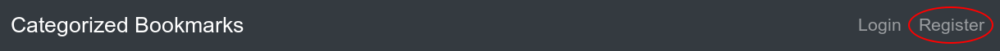
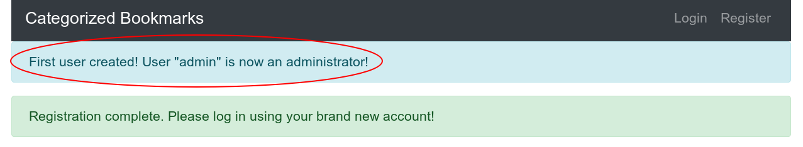
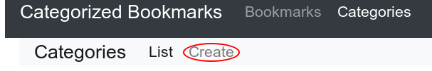
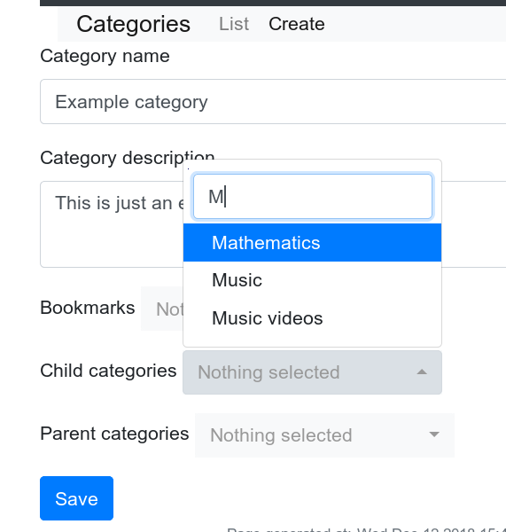
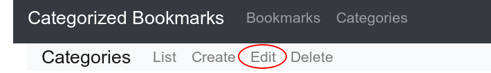
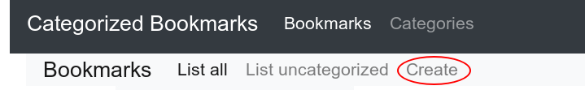
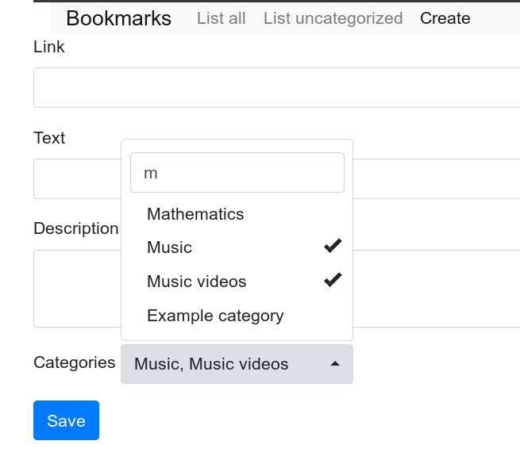
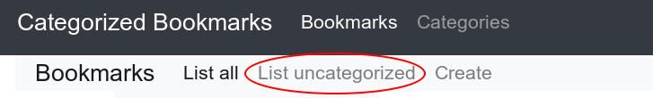

# User guide

## Creating a new user account

Just click on the `Register` link and fill out the form. A new account will be created for you to use.

NB: The first user created on the system will be granted administrator role.

## Logging in

After creating your credentials you can log in by clicking the `Login` link.

## Creating a new category

Activate category list by clicking the `Categories` link on the navigation bar. Now just click the `Create` link.

Enter a category name and an optional description and click `Save`. Additionally you can select bookmarks, child categories and parent categories from the select lists.

## Editing an existing category

Click on `Categories` from the navigation bar to activate categories list. Click on the category to view it.

Now click `Edit` in the navigation bar.

## Deleting a category

Similar to edit, but just click `Delete` instead.

## Creating a new bookmark

Activate bookmark list by clicking the `Bookmarks` link on the navigation bar. Now click `Create` and enter bookmark link, text and optional description.

Fill out the form and click save.

Optionally you can assign the bookmark to one or more categories by clicking on the `Nothing selected` select field on choosing categories by clicking on them.

## Editing a bookmark

In the bookmark list click on `Actions` dropdown and choose `Edit`.

## Deleting a bookmark

Just like editing, but instead choose `Delete`.

## Assigning a bookmark to a category

You can add a bookmark to a category from bookmark `Edit` view or alternatively from category `Edit` view.

## Listing uncategorized bookmarks

Click on `List uncategorized` in the bookmark navigarion bar.

