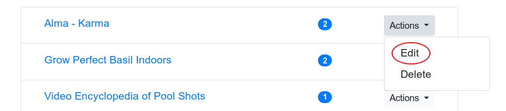

# User guide

## Creating a new user account

Just click on the `Register` link and fill out the form. A new account will be created for you to use.

NB: The first user created on the system will be granted administrator role.

## Logging in

After creating your credentials you can log in by clicking the `Login` link.

## Creating a new category

Activate category list by clicking the `Categories` link on the navigation bar. Now just click the `Create` link.

Enter a category name and an optional description and click `Save`. Additionally you can select bookmarks, child categories and parent categories from the select lists.

## Editing an existing category

Click on `Categories` from the navigation bar to activate categories list. Click on the category to view it.

Now click `Edit` in the navigation bar.

## Deleting a category

Similar to edit, but just click `Delete` instead.

## Creating a new bookmark

Activate bookmark list by clicking the `Bookmarks` link on the navigation bar. Now click `Create` and enter bookmark link, text and optional description.

Fill out the form and click save.

Optionally you can assign the bookmark to one or more categories by clicking on the `Nothing selected` select field on choosing categories by clicking on them.

## Editing a bookmark

In the bookmark list click on `Actions` dropdown and choose `Edit`.

## Deleting a bookmark

Just like editing, but instead choose `Delete`.

## Assigning a bookmark to a category

You can add a bookmark to a category from bookmark `Edit` view or alternatively from category `Edit` view.

## Listing uncategorized bookmarks

Click on `List uncategorized` in the bookmark navigarion bar.

## Searching for bookmarks

There are three different ways to search bookmarks, let's go through them one by one.

### Text search

Text search searches bookmark's link, text and description for match.

Activate text search by clicking on `Search` link in the `Bookmarks` navigation bar.

Now you can search all your bookmarks by entering search string to the input field and hitting enter or clicking `Search`.

### Categories search

There's a select field in bookmarks list page, where you can list bookmarks in one or more categories. When listing bookmarks in a category also the bookmarks in child categories will be listed. When opting for more than one category, then the bookmarks that are in _all_ those categories will be listed.

### Category listing

Finally it's possible to list bookmarks in categories from the `Categories` view. Click on the category to view it.

In the category view you can see the bookmarks in the category and the category's parent and child categories.

## Congratulations!

Congratulations, you have now finished one the most demanding training session on earth!

And special thanks from the author for actually reading this far!
